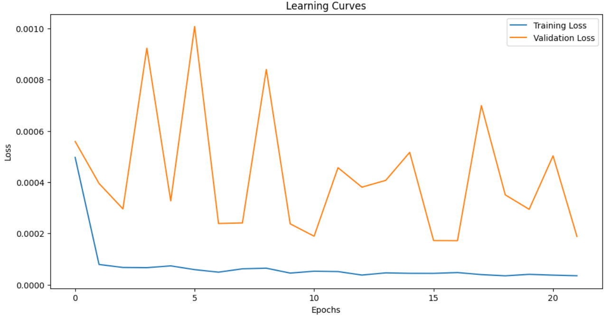
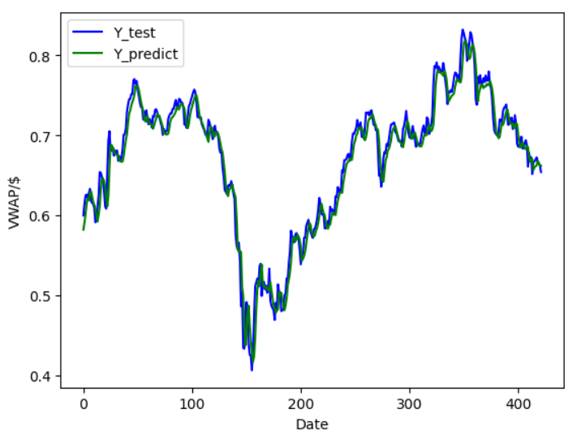
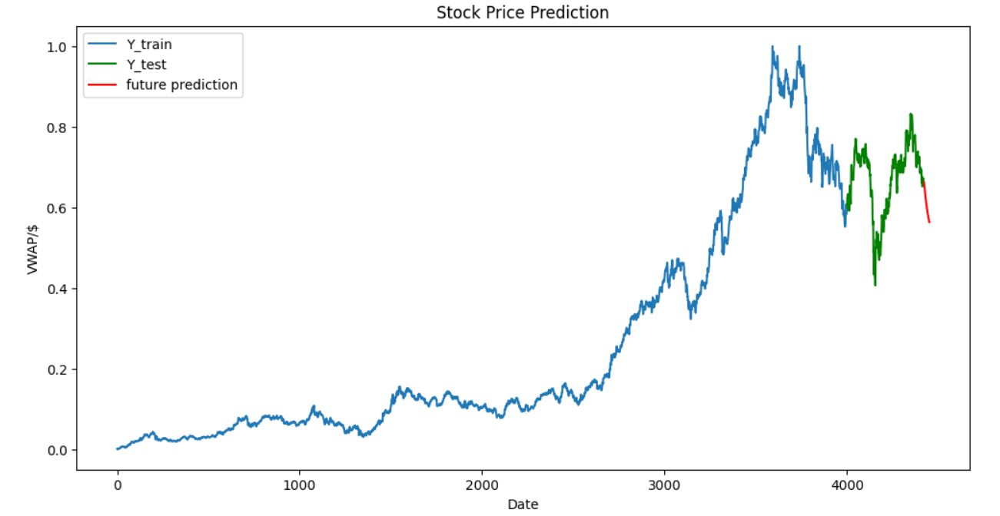

# Stock-Price-Prediction-System

A machine learning-based system designed to **predict stock prices using historical time-series data**.

This project demonstrates the end-to-end ML pipeline including **data preprocessing, feature engineering, model training, and prediction visualization**.

---

## Problem Statement

Stock price prediction is a challenging task due to the **high volatility, non-linearity, and noise** in financial time-series data. Traditional statistical models often fail to capture complex patterns in stock movements.

The goal of this project is to build a **machine learning-based system** that can learn from historical stock data and predict future price trends.

---

## Solution

This system applies **deep learning model (LSTM model)** to analyze historical stock data and generate future predictions.

Key capabilities:

- Analyze historical stock price trends  
- Predict future stock prices  
- Visualize actual vs predicted values  
- Provide insights for data-driven decision making

System Workflow:

Stock Data → Preprocessing → Model Training → Prediction → Visualization

---

## Machine Learning Pipeline

1. Data Collection (historical stock prices)
2. Data Preprocessing (handling missing values, normalization)
3. Feature Engineering (time-based features, indicators)
4. Train-Test Split
5. Model Training (LSTM model)
6. Model Evaluation
7. Prediction & Visualization

---

## Results & Model Evaluation

The LSTM model was evaluated using multiple regression performance metrics to ensure a comprehensive assessment of its predictive capability on unseen data.

### 🔹 Evaluation Metrics

| Metric       | Value  | Description                                                     |
| ------------ | ------ | --------------------------------------------------------------- |
| **RMSE**     | 0.0167 | Measures the standard deviation of prediction errors            |
| **MAE**      | 0.0123 | Average absolute difference between predicted and actual values |
| **R² Score** | 0.962  | Indicates the proportion of variance explained by the model     |

---

### 🔹 Performance Interpretation

* The model achieved an **R² score of 0.962**, indicating that approximately **96.2% of the variance** in stock prices is captured by the model.
* The **low RMSE (0.0167)** and **MAE (0.0123)** values suggest that prediction errors are minimal.
* Training and validation loss curves demonstrate **stable learning behavior** with no significant overfitting, aided by Early Stopping.

---

### 🔹 Visual Validation

* Learning curves indicate proper convergence during training.

* Predicted values closely follow the actual test data trend.

  
* Future predictions show a consistent trend based on learned temporal patterns.

---

## Key Observations

* The LSTM model effectively captures short-term temporal patterns (5-day window).
* Hyperparameter tuning further improved model performance.
* The model generalizes well on test data, indicating robustness.

---

## Tech Stack

- Programming : Python
- Libraries   : Pandas | NumPy | Scikit-learn | TensorFlow / Keras | Matplotlib 
- Concepts    : Time Series Forecasting | Machine Learning | Deep Learning

---

